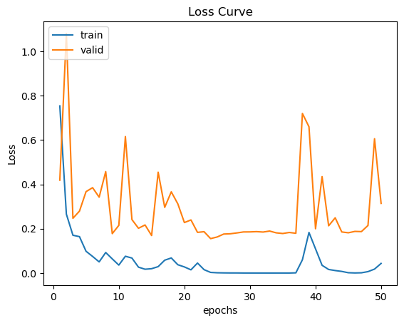
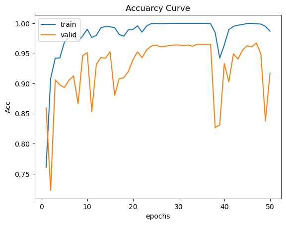
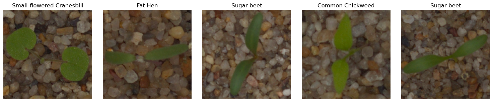
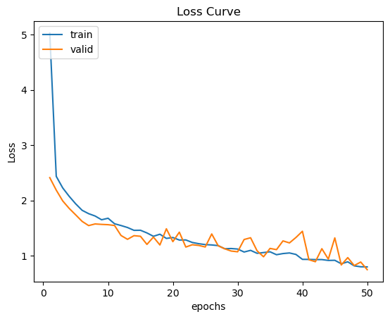
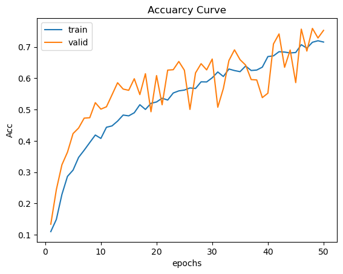

# CCU
# ML_Assignment_1

Training on both nvidia RTX3060.
# RTX3060
## ResNet50 
### 1. Loss Curve

### 2. Acc Curve

### 3. Predict Result

## VGG16
### 1. Loss Curve

### 2. Acc Curve

### 3. Predict Result

